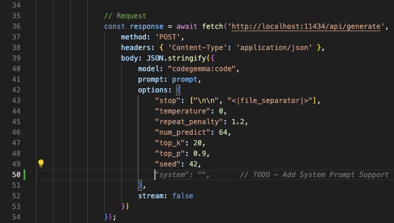
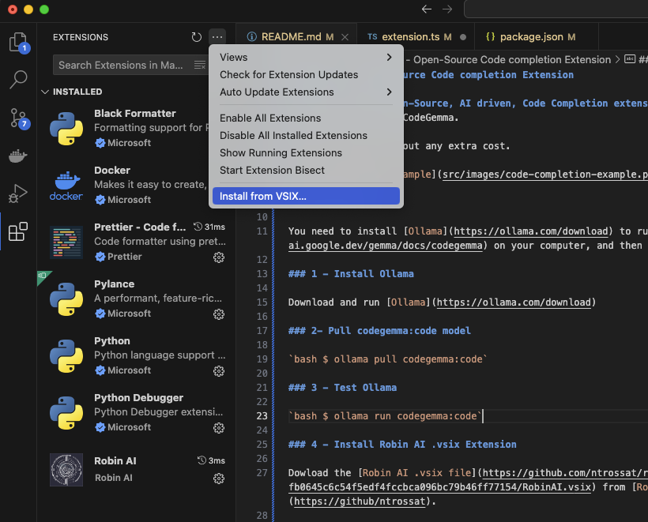

# Robin AI - Inline Code Completion Extension

**Robin AI is an Open-Source, AI-driven, Inline Code Completion extension for VScode, powered by Ollama and CodeGen.**

It runs locally on your machine, offering privacy and no need for an internet connection.



## Installation

**Before you begin, you'll need to install Ollama on your computer.** Ollama allows you to run [CodeGemma](https://ai.google.dev/gemma/docs/codegemma), the AI model that powers Robin AI.

### 1 - Install Ollama

Download and run [Ollama](https://ollama.com/download)

### 2- Pull codegemma:code model

`ollama pull codegemma:code`

### 3 - Test Ollama

`ollama run codegemma:code`

### 4 - Install Robin AI .vsix Extension

Dowload the latest [Robin AI extension](https://github.com/ntrossat/robin-ai/blob/fb0645c6c54f5edf4fccbca096bc79b46ff77154/RobinAI.vsix) from [Robin AI](https://github/ntrossat/robin-ai) Github Repo.

On VSCode, select the Extensions tab, click on the three dots, and select "Install from VSIX..."



## Usage

Just type your code, and Robin AI will propose relevant code completions. Select the desired completion to accept it or hit "Tab".

Adding comments to your code can improve the accuracy of Robin AI's suggestions, as comments provide additional context about your code's functionality.

## Limitations

Robin AI is currently under development, and its capabilities are constantly improving. It primarily focuses on the code within the file you're working on and may not always understand the broader project context.

## Development Notes

If you're interested in contributing to Robin AI's development, or tailor the extension to your need, you can clone the project repository and follow the instructions below:

```bash
git clone git@github.com:ntrossat/robin-ai.git
cd robin_ai
npm install
```

### Update VSCode Extension

`npm run vscode:package`
